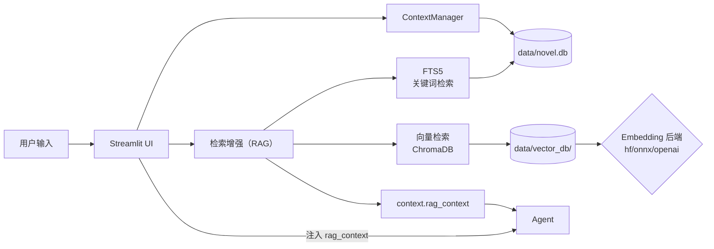

# FantasyNovelAgent 开发指南

这份文档旨在帮助开发者（包括人类开发者和 AI Agent）快速理解 `FantasyNovelAgent` 项目的架构、逻辑流和数据结构，以便快速上手进行维护或功能扩展。

## 1. 项目简介
`FantasyNovelAgent` 是一个基于 Streamlit 的多智能体（Multi-Agent）小说创作辅助系统，专为创作现代玄幻风格（爽文）小说设计。系统通过多个专职 Agent 协作，实现从灵感推演、大纲生成、正文撰写、文风润色到逻辑检查的全流程辅助，并具备自动化的记忆管理功能。


## 2. 目录结构说明

```text
FantasyNovelAgent/
├── app.py                  # [入口] 应用程序主入口，UI 渲染与逻辑控制中心
├── config.py               # [配置] 环境变量与 API 配置管理
├── deploy.sh               # [部署] Mac -> Pi 一键部署脚本
├── DEPLOY_PI.md            # [文档] 树莓派详细部署指南
├── DEVELOPER_GUIDE.md       # [文档] 开发指南（本文件）
├── DATA_STRUCTURE.md        # [文档] 数据结构说明
├── requirements.txt        # [依赖] Python 依赖列表
├── .env.example            # [环境] 环境变量示例文件
├── .gitignore              # [Git] 版本控制忽略配置
├── data/                   # [数据] 数据持久化目录
│   ├── config/             # 存放 model_profiles.json (模型配置)
│   ├── logs/               # 运行日志与指标相关输出（app.log/usage_stats.json 等，运行时自动创建）
│   ├── novel.db            # [核心] SQLite 数据库 (存储小说正文、记忆、草稿)
│   ├── vector_db/          # [索引] ChromaDB 本地向量索引（可从 novel.db 重建）
│   └── chat_sessions/      # [会话] 多窗口聊天记录（JSON）
├── .streamlit/
│   └── config.toml         # [配置] Streamlit 服务器配置
├── agents/                 # [核心] 智能体实现目录
│   ├── base_agent.py       # Agent 基类，处理 LLM 调用（含 RAG 注入）
│   ├── muse.py             # 灵感缪斯：负责创意、大纲、正文生成
│   ├── stylist.py          # 风格统御者：负责文风润色
│   ├── guard.py            # 逻辑守卫：负责逻辑检查、设定冲突检测
│   ├── archivist.py        # 记忆管理员：负责数据提取、整理、归档
│   ├── world_builder.py    # [新增] 世界观架构师：负责设定生成与评估
│   ├── critic.py           # [新增] 毒舌书评人：负责爽点/毒点点评
│   └── intent_router.py    # 意图路由：识别用户指令意图
└── utils/                  # [工具] 通用工具库
    ├── memory_manager.py   # 数据与检索门面：SQLite + 向量索引 + 上下文构建
    ├── storage.py          # SQLite 存储层（KV/chapters/drafts/FTS5/oplog 等）
    ├── vector_manager.py   # ChromaDB 封装（collection、embedding、query）
    ├── chunking.py         # 语义分块（按段落/句子边界优先）
    ├── id_utils.py         # ULID 生成（为多端/迁移打底）
    ├── db_manager.py       # SQLAlchemy 关系型数据库模型与管理（关系表落在 novel.db 内）
    ├── model_profiles.py   # 负责 data/config/ 下的配置管理
    └── usage_tracker.py    # [新增] 负责模型用量统计
```

## 3. 核心交互流程

系统运行的核心逻辑是 **Context-Action-Memory Loop**：

1.  **上下文构建 (Context Construction)**:
    - 每次操作前，`app.py` 通过 `memory_manager.py` 读取最新的剧情、角色、世界观和未来规划，构建完整的上下文 (`context`)。
    - *关键代码*: `memory.get_full_context()` 或 `memory.get_brainstorming_context()`。

2.  **检索增强 (Retrieval / RAG)**:
    - 在创作/审查/问答等主流程调用 LLM 之前，系统会进行检索增强，把命中的原文片段注入到 `context['rag_context']`。
    - 检索引擎为“双引擎并列”：
      - **FTS5（关键词检索）**：适合人名/地名/法宝等确定性名词查询。
      - **向量检索（语义相似）**：适合氛围/口癖/相似场景召回。
    - 主窗口提供模式切换：Hybrid / 仅关键词 / 仅语义。
    - 注入位置：`BaseAgent._inject_rag()` 会把 `rag_context` 拼接到用户消息里。



3.  **智能体行动 (Agent Action)**:
    - 用户输入通过 `IntentRouter` 分发给特定的 Agent。
    - **Muse**: 生成大纲 (`brainstorm`) 或正文 (`draft`)。
    - **Guard**: 检查生成内容的逻辑 (`critique`) 或新规划的冲突 (`check_future_plan_contradiction`)。
    - **Stylist**: 润色正文 (`polish`)。
    - **WorldBuilder**: 生成或优化设定 (`create_settings`)。
    - **Critic**: 点评剧情 (`critique`)。

4.  **记忆更新 (Memory Update)**:
    - 新内容生成后，`Archivist` 分析文本，提取“角色状态变更”、“剧情摘要”、“新设定”等信息 (`propose_updates`)。
    - 系统生成一个“记忆更新提案” (Proposal)。
    - 用户确认后，`ContextManager` 将更新写入 `data/novel.db`（以及同库关系表），完成记忆闭环。

## 4. 智能体 (Agents) 职责详解

| Agent | 文件 | 职责描述 | 核心方法 |
| :--- | :--- | :--- | :--- |
| **Muse** | `muse.py` | **主笔/策划**。负责剧情推演、大纲生成、正文撰写。具备“爽文”逻辑，优先考虑未来规划。提供本地兜底逻辑 (`brainstorm_local`) 以防 API 故障。 | `brainstorm`, `draft`, `rewrite` |
| **Stylist** | `stylist.py` | **润色**。负责将朴素的文本转化为现代玄幻风格，优化打斗描写和环境渲染。 | `polish` |
| **Guard** | `guard.py` | **质检/问答**。检查逻辑漏洞、战力崩坏、设定冲突。也负责基于记忆库回答用户提问。 | `critique`, `check_future_plan_contradiction`, `answer_question` |
| **Archivist** | `archivist.py` | **记录**。从非结构化文本中提取结构化数据（JSON）。负责维护记忆库的整洁和更新。 | `propose_updates`, `check_future_plans_coverage` |
| **WorldBuilder** | `world_builder.py` | **架构**。负责世界观设定的生成与评估。 | `create_settings` |
| **Critic** | `critic.py` | **点评**。负责爽点/毒点点评。 | `critique` |
| **Router** | `intent_router.py` | **调度**。分析用户输入的自然语言，判断意图（创作、提问、修正等）。 | `route` |

## 4.5 可观察性（Metrics / Logs）

项目当前采用 Prometheus 指标 + 结构化日志（JSON 行），用于在 Grafana 上观察 LLM 调用、检索瓶颈、重试压力与关键链路耗时。当前未引入 tracing。

### 4.5.1 Prometheus Metrics

#### 导出地址

默认启动：

- `http://127.0.0.1:9108/metrics`

端口占用时会自动尝试 `9108~9139` 的下一个可用端口，并在 `data/logs/app.log` 写入 `metrics_started`（含最终端口）。

环境变量：

- `FNA_METRICS=1|0`：是否启用 metrics（默认 `1`）
- `FNA_METRICS_HOST`：绑定地址（默认 `127.0.0.1`；容器化/远程抓取时建议 `0.0.0.0`）
- `FNA_METRICS_PORT`：端口（默认 `9108`）

启动入口：

- 应用启动时调用 `init_observability()`：[app.py](file:///Users/sun/Desktop/chenfeng/editor/FantasyNovelAgent/app.py#L22-L31)

#### 指标列表

LLM 调用：

- `fna_llm_requests_total{agent,model,provider,status}`：LLM 请求次数
- `fna_llm_latency_seconds_bucket{agent,model,provider,status}`：LLM 请求耗时直方图
- `fna_llm_tokens_total{agent,model,provider,kind}`：tokens 计数（`kind=prompt|completion|total`）

埋点位置：

- [base_agent.py](file:///Users/sun/Desktop/chenfeng/editor/FantasyNovelAgent/agents/base_agent.py)

检索（RAG Retrieval）：

- `fna_retrieval_requests_total{op,status}`：检索调用次数
- `fna_retrieval_latency_seconds_bucket{op,status}`：检索耗时直方图

当前 `op`：

- `search_hybrid`
- `search_vectors`
- `search_chapters_fts`

常见 `status`：

- `success`：成功返回
- `error`：异常
- `disabled`：向量检索被关闭（`DISABLE_VECTOR=1`）
- `empty`：空 query

埋点位置：

- [memory_manager.py](file:///Users/sun/Desktop/chenfeng/editor/FantasyNovelAgent/utils/memory_manager.py)

RAG 风险处置（RAG Guard）：

- `fna_rag_snippets_total{source_type,trust_tier,risk,action}`：按风险处置统计命中片段数
- `fna_errors_total{component,kind}`：RAG Guard JSON 解析失败等非 LLM 错误

Fact Guard 阻断：

- `fna_fact_guard_blocks_total{kind}`：Fact Guard 阻止写入次数

资源护栏（重试/最终失败）：

- `fna_agent_call_retries_total{op}`：重试次数（按“被包装的调用”聚合）
- `fna_agent_call_failures_total{op}`：最终失败次数（耗尽 max_attempts）

埋点位置：

- [_agent_call_with_limit](file:///Users/sun/Desktop/chenfeng/editor/FantasyNovelAgent/app.py#L2088-L2110)

关键用户链路耗时（“API 维度”看板）：

- `fna_flow_latency_seconds_bucket{flow,status}`：关键链路总耗时直方图

当前 `flow`：

- `brainstorm`
- `draft`
- `critique`
- `apply_memory_update`

#### Grafana 常用 PromQL 示例

- LLM 耗时 P95：
  - `histogram_quantile(0.95, sum by(le,agent,model) (rate(fna_llm_latency_seconds_bucket[5m])))`
- LLM 错误率：
  - `sum(rate(fna_llm_requests_total{status="error"}[5m])) / sum(rate(fna_llm_requests_total[5m]))`
- 检索耗时 P95：
  - `histogram_quantile(0.95, sum by(le,op) (rate(fna_retrieval_latency_seconds_bucket[5m])))`
- 重试热榜：
  - `topk(10, sum by(op) (increase(fna_agent_call_retries_total[15m])))`
- 关键链路耗时 P95：
  - `histogram_quantile(0.95, sum by(le,flow) (rate(fna_flow_latency_seconds_bucket[5m])))`

### 4.5.2 结构化日志（Structured Logs）

输出位置与格式：

- 输出文件：`data/logs/app.log`
- 格式：每行一条 JSON（便于 Loki/Vector/Fluent Bit 收集）
- 级别：`FNA_LOG_LEVEL`（默认 `INFO`）

关键事件：

- `app_started`：应用启动
- `metrics_started`：metrics server 启动成功
- `metrics_disabled` / `metrics_unavailable`：metrics 被关闭或依赖不可用
- `llm_call`：每次成功 LLM 调用（包含 agent/model/base_url/latency_ms；如可得则含 token；走 Cloudflare AI Gateway 时还会包含 cfAigEventId/cfAigLogId 等）
- `llm_error`：LLM 调用异常（不包含密钥）
- `rag_audit`：RAG 风险处置审计（统计 kept/redacted/dropped）
- `fact_guard_block`：Fact Guard 阻断写入

实现位置：

- [observability.py](file:///Users/sun/Desktop/chenfeng/editor/FantasyNovelAgent/utils/observability.py)

#### 停止本地服务（清理残留端口）

Streamlit 热更新可能导致旧进程未完全退出，表现为多个 metrics 端口同时可访问。可使用：

- `bash scripts/stop_all_services.sh`

### 4.5.3 常见问题

为什么会出现多条 `app_started`？

- Streamlit 在热重载/多进程模式下会产生多个进程或重启，因此启动日志可能多次出现；metrics 也可能随进程重启而切换

为什么本机访问不到 `:9108/metrics`？

- 检查 `FNA_METRICS` 是否为 `1`
- 检查端口是否被占用（换 `FNA_METRICS_PORT`）
- 检查绑定地址是否合适：本地通常用 `127.0.0.1`，容器/远端抓取需 `0.0.0.0`

## 5. 数据存储与记忆系统 (Data Architecture)

自 2026-01-25 起，系统已从文件存储迁移至 **SQLite 数据库**，并逐步引入“关系型结构数据库”以支持更复杂的检索与联动。

### 5.1 核心数据 (`data/novel.db`)
所有的创作内容均存储在此 SQLite 数据库中：
*   **`chapters` 表**: 章节元数据（标题、时间、稳定 ID）。
    * `ulid`：稳定可迁移的唯一标识（为多端离线合并与索引对齐打底）。
    * `content_key`：章节正文在对象存储中的 key（为 D1/R2 等“正文拆分”做准备）。
    * `mentioned_character_ids`：本章“提及角色”列表（JSON 字符串，存角色表 ID 数组）。用于章节筛选与 UI 展示（只显示本章相关角色，而非全角色库）。
    * `primary_character_id`：章节主视角角色（已停用/弃用：对应 UI 与检索过滤已移除；字段暂保留用于兼容旧库与未来可能的重新设计）。
*   **对象存储（本地）**：章节正文默认写入 `data/blob_store/chapters/{chapter_ulid}.txt`（key 形如 `chapters/{chapter_ulid}.txt`），数据库通常只保存 `content_key`，不再冗余保存整段正文到 `chapters.content`（仅在对象写入失败时才可能回退写入 DB 以防丢失）。
*   **`drafts` 表**: 写作草稿。
*   **`kv_store` 表**: 存储非结构化记忆数据（Key-Value 形式）。
    *   `plot_summaries`: 剧情摘要 (JSON)
    *   `character_db`: 角色数据库 (JSON)
    *   `map_db`: 地图数据 (JSON)
    *   `world_settings`: 世界观设定 (Text)
    *   `future_plans`: 未来规划 (JSON)
    *   `style_guide.md`: 风格指南（Markdown）
    *   `device_ulid`: 当前设备标识（为 op-log 同步预留）

*   **`chapters_fts` (FTS5)**: 章节全文检索虚表（title/content），当前由 `save_chapter()` 进行“手动更新”（触发器已移除），以适配“正文可能拆分到 blob store”的架构。
*   **`oplog` 表**: 操作日志（骨架），记录章节 upsert 与 KV set，便于未来做“多端离线编辑后合并”。

### 5.2 关系型结构表（实验，落在 `data/novel.db` 内）
在保留 `kv_store` 的同时，项目引入关系型结构表，把部分 KV 结构“拆表”成可查询、可关联的实体（角色/势力/地点/法宝/功法等），以便：
* 更快的实体检索与聚合（例如：查某角色名下所有法宝与功法）
* 更可靠的实体关系维护（例如：角色-势力、角色-功法 等多对多关系）

当前状态：
* Streamlit 主程序仍以 `data/novel.db` 为“事实来源（Source of Truth）”
* 关系表与 KV 同库（单一数据库文件），降低跨库一致性与部署复杂度

相关实现：
* 关系型模型与 DB 管理：[db_manager.py](file:///Users/sun/Desktop/chenfeng/editor/FantasyNovelAgent/utils/db_manager.py)
* KV -> 关系型迁移脚本：[migrate_to_sql.py](file:///Users/sun/Desktop/chenfeng/editor/FantasyNovelAgent/scripts/migrate_to_sql.py)

迁移建议（本机/树莓派一致）：
1. 先备份 `data/novel.db`
2. 执行迁移脚本，在 `data/novel.db` 内创建/更新关系表

### 5.2 索引层（可重建）
系统坚持 `data/novel.db` 为事实来源；检索索引允许损坏/冲突后重建：
* **向量索引**：`data/vector_db/`（ChromaDB 本地持久化）。
  - 由章节语义分块 + embedding 构建
  - 重建脚本：`scripts/init_vector_db.py`

### 5.3 配置文件 (Files)
为了安全和管理方便，部分数据仍保留为文件：
*   **`data/config/model_profiles.json`**: 模型 API 密钥配置。
    *   **结构变更 (v0.2.1)**: 新增 `llm_routing` 字段，支持按 Agent 分配模型。
    *   `mode`: "unified" (统一) 或 "per_agent" (分流)。
    *   `agent_profile_ids`: `{ "Muse": "id1", "Guard": "id2" ... }`。
*   **`data/config/storage_sync.json`**: 数据存储与同步配置（当前用于“云端对象存储（章节正文）”）。
    * `object_store.enabled`: 是否启用云端对象存储（R2/S3）。
    * `object_store.provider`: `r2|s3` 等（S3 兼容协议）。
    * `object_store.bucket/endpoint/region/access_key_id/secret_access_key/prefix`: 连接参数。
    * `object_store.read_prefer_local / write_mirror_local`: 本地缓存策略（本地目录仍为 `data/blob_store/`）。
    * `object_store.strict_write_remote`: 严格模式（云端失败即报错）vs 非严格模式（可降级 + 自动补传）。
*   **`data/logs/usage_stats.json`**: Token 用量统计日志。

### 5.4 多端同步（现状与边界）
* `data/novel.db` 是单机一致性与“单一事实来源”的基础，但**同步 db 文件不等于解决多端并发合并**。
* 当前实现仅提供 `oplog` 的骨架，尚未实现 op-log 的跨端回放与冲突解决；在多端场景下请避免依赖“网盘同步 db 文件”来合并修改。

### 5.5 架构演进过渡：前后端分离 (Backend Decoupling)
在迈向云原生架构之前，建议先进行**应用层的解耦**。

**当前状态 (Monolith)**:
`app.py` (Streamlit) 同时负责 UI 渲染、业务逻辑调度 (Agents) 和数据库读写 (Storage)。

**目标状态 (Decoupled)**:
1.  **后端 (API 层)**: 使用 **FastAPI** 封装核心逻辑。
    *   提供 RESTful 接口：`POST /api/brainstorm`, `GET /api/chapters`, `POST /api/memory/update`.
    *   独立部署，不依赖界面库。
2.  **前端 (UI 层)**: Streamlit (或未来的 React/Flutter) 仅作为客户端，通过 HTTP 请求与后端交互。

### 5.6 未来架构规划 (Cloud Native Migration)
随着小说篇幅增长，建议采用 **“数据库 + 对象存储”** 的混合架构。

| 数据类型 | 推荐存储位置 | 理由 |
| :--- | :--- | :--- |
| **元数据/结构化数据** | **数据库 (D1/SQLite)** | 章节列表、角色库、剧情摘要需要高频读取和复杂查询。 |
| **大文本/多媒体** | **对象存储 (R2/S3)** | 小说章节正文、写作草稿、图片素材体积大且读写简单，分离存储可降低数据库负载。 |

**迁移策略**:
1.  **正文分离**: 数据库 `chapters` 表仅存 `id` 和 `s3_key`，正文内容存入 R2。
2.  **摘要保留**: 剧情摘要 (`plot_summaries`) 继续留在数据库，以便 Agent 快速检索上下文。

#### 5.6.1 已落地：云端对象存储（R2，S3 兼容）
项目已支持通过 **S3 兼容 API** 将章节正文写入 Cloudflare R2（不要求前后端分离，不要求 Worker）：
* 配置入口：`🔧 通用设置 → 🗄️ 数据存储与同步 → 云端对象存储（章节正文）`
* 本地缓存目录：`data/blob_store/chapters/`（可选读本地优先、写入镜像本地）
* 自动补传队列（非严格模式）：`data/config/object_store_pending_puts.json`
* 迁移已有正文：在同一设置区提供“一键迁移”按钮；也可使用脚本 `scripts/migrate_local_chapters_to_object_store.py`

### 5.7 本地开发策略 (Local Dev Strategy)
针对未来引入的对象存储 (Object Storage)，推荐以下两种本地开发方案：

1.  **文件系统模拟 (推荐)**:
    *   **原理**: 实现一个 `FileBlobStorage` 适配器，在本地将“对象”存为 `data/blobs/` 下的普通文件。
    *   **优势**: 零依赖，无需安装 Docker 或额外服务，开发体验最流畅。
    *   **生产环境**: 上线时切换为 `R2BlobStorage` 即可。

2.  **MinIO (Docker)**:
    *   **原理**: 在本地运行 MinIO 容器模拟 S3 API。
    *   **命令**: `docker run -p 9000:9000 minio/minio server /data`
    *   **优势**: API 与 AWS S3/Cloudflare R2 完全兼容，适合测试 SDK 集成。

## 6. 关键功能模块实现

### 6.1 自动推演新剧情
-   **触发**: 界面“自动推演新剧情”按钮。
-   **逻辑**: 调用 `Muse.brainstorm`。
-   **输入**: 最近 10 章摘要 + 世界观 + 相关角色 + 最近 3 章原文 + 未来规划。
-   **输出**: 3 个剧情分支选项。
-   **容错**: 若 API 失败，提供 `brainstorm_local` 本地模板生成。

### 6.2 记忆自动更新
-   **触发**: 用户确认归档章节或保存草稿时。
-   **逻辑**: 调用 `Archivist.propose_updates` 生成 JSON 提案 -> 用户确认 -> `memory_manager` 写入文件。
-   **自动化**: 同时调用 `Archivist.check_future_plans_coverage` 检测是否完成了某些未来规划，并提示移除。

### 6.3 未来发展规划
-   **功能**: 独立的记忆库 Tab。
-   **逻辑**: 添加时调用 `Guard.check_future_plan_contradiction` 确保存入的计划不与现有设定冲突。

### 6.4 模型用量追踪
-   **功能**: 自动记录每次 API 调用的 Token 消耗。
-   **实现**: `utils/usage_tracker.py` 拦截 API 调用并写入 `data/logs/usage_stats.json`。
-   **UI**: 在“模型管理”界面提供可视化的历史用量柱状图。

### 6.5 UI 交互增强
-   **头脑风暴分支**: `Muse` 生成的剧情分支现在以独立按钮呈现，支持点选或输入新指令。
-   **章节号确认**: 归档记忆时，系统会自动推断章节号（自动递增），但提供显式的数字输入框供用户确认或修改，避免错误归档。
-   **角色快速聚焦弹窗**: “角色状态”页支持在弹窗内快速查看角色详情，并支持：
    - 弹窗内相关跳转按钮可点击并刷新弹窗内容（基于 `expanded_entity_name`）
    - 侧边栏可操作且点击外部不自动关闭（通过对遮罩点击进行拦截）
    - 弹窗可拖动（使用右上角拖拽热区）

#### 6.5.1 角色快速聚焦弹窗实现要点（2026-01-27）
该交互属于“UI + 事件层 + SessionState”组合问题，推荐把实现逻辑拆成三块看：

### 6.6 章节级“提及角色”与角色筛选（2026-01-28）
为了避免“每章下拉框塞满全角色库”的噪音，并提升定位效率，项目引入了章节级的“提及角色子集”：

* **生成时机**
  - 归档/保存章节正文时：从正文里匹配角色库已存在的角色名，写入 `chapters.mentioned_character_ids`。
  - 兼容旧章节：当读取某章的 `mentioned_character_ids` 为空时，会懒加载一次（读取正文 -> 匹配 -> 写回），之后无需重复计算。
* **UI 使用**
  - 章节库右侧展示“本章提及角色”（用于快速感知该章涉及人物）。
  - 章节库左侧提供“角色筛选”（多选）：只显示提到所选角色的章节。
* **边界与约束**
  - “本章提及角色”是“角色库全量”的子集：只会从角色库已有角色中做匹配，不会凭空创建新角色。
  - 若正文出现新人物但角色库尚未收录，需先通过记忆提炼或手动维护把角色加入角色库，之后该人物才会进入匹配结果。

### 6.7 开发期缓存策略（Streamlit Resource Cache）
`ContextManager` 通过 `st.cache_resource` 缓存可显著减少初始化开销，但开发期可能导致“代码已改、实例仍旧”的错觉。

* 当前实现会将 `app.py / utils/storage.py / utils/memory_manager.py` 的修改时间拼成 cache key，确保这些核心文件变更后自动重建 `ContextManager`，避免热更新期间读到旧逻辑。

### 6.8 Embedding 后端（EMBEDDING_BACKEND）
向量索引/向量检索需要把文本编码为向量（embedding）。本项目支持多种 embedding 后端，通过环境变量 `EMBEDDING_BACKEND` 选择。

* **可选值**
  - `hf`：本地 HuggingFace + torch（默认，适合 Mac/PC；不走网络；CPU 上可用但速度取决于机器性能）。
  - `onnx`：本地 ONNX 推理（用于在部分环境中提升兼容性/稳定性）。
  - `openai`：调用 OpenAI Embeddings API（需要联网与 OpenAI API Key；按用量计费；在树莓派等 ARM 环境通常更稳）。
* **默认策略**
  - 若未设置 `EMBEDDING_BACKEND`：
    - 在树莓派 64 位（Linux aarch64 且检测到 Raspberry Pi）上默认选 `openai`；
    - 其他环境默认选 `hf`。
* **费用与资源权衡**
  - `openai`：有调用费用，但对设备算力要求低、兼容性高。
  - `hf/onnx`：通常“免费”（不产生 API 调用费），但对本地环境依赖更重；在 ARM 环境可能出现推理库不兼容导致崩溃的情况。
* **与 `DISABLE_VECTOR` 的关系**
  - `DISABLE_VECTOR=1` 会彻底关闭向量索引与向量检索（只保留 FTS5 关键词检索），此时 `EMBEDDING_BACKEND` 不生效。

1. **弹窗内跳转（相关链接）**
   - 入口函数：`render_links()` 会扫描文本中出现的其他角色名，并生成跳转按钮。
   - 关键点：使用 `if st.button(...):` 直接分支处理点击并 `st.rerun()`，避免某些情况下 `on_click` 回调链路不触发。
   - 参考实现：[app.py:render_links](file:///Users/sun/Desktop/chenfeng/editor/FantasyNovelAgent/app.py#L2437-L2461)

2. **弹窗不自动关闭，但侧边栏仍可操作**
   - 思路：不再做全局事件拦截/重派发，而是只在捕获阶段拦截“遮罩背景点击”（`e.target === wrapper`）。
   - 同时通过 z-index 让 sidebar 高于遮罩层，避免 sidebar 被遮罩盖住。
   - 参考实现：[app.py:focus modal CSS/JS](file:///Users/sun/Desktop/chenfeng/editor/FantasyNovelAgent/app.py#L2475-L2510)

3. **弹窗拖拽与位置记忆**
   - 思路：使用弹窗右上角的一个透明拖拽热区（32x32），避免覆盖弹窗内容导致按钮/链接点击失效。
   - 位置记忆：存储在 `localStorage`，键为 `fn_focus_dialog_pos`。
   - 参考实现：[app.py:drag handle](file:///Users/sun/Desktop/chenfeng/editor/FantasyNovelAgent/app.py#L2512-L2601)

### 6.6 设定生成与评估
-   **功能**: `WorldBuilder` 负责根据现有剧情生成新势力、功法或评估设定冲突。

### 6.7 智能书评
-   **功能**: `Critic` 负责对生成的正文进行爽点分析和毒点预警。

### 6.8 剧情推演增强
-   **功能**: 自动识别推演意图，并允许一键将推演结果保存为“后台推测”或“未填坑”。
-   **逻辑**: 在 `Muse` 的 `brainstorm` 响应中，若检测到“推演/推测”等关键词，自动附加元数据。
-   **存储**: 分别写入 `data/novel.db` 的关系表 `plot_inferences` 与 `unresolved_mysteries`（同库，便于一致性维护）。

### 6.9 检索与 RAG（索引层双引擎）
- **FTS5（关键词）**：`ContextManager.search_chapters_fts()`（返回 snippet/bm25 排序）
- **向量（语义）**：`ContextManager.search_vectors()`（ChromaDB）
- **Hybrid（关键词+语义）**：`ContextManager.search_hybrid()`（FTS 与向量并行检索，并用 RRF 思路做融合排序，避免关键词未命中导致语义召回丢失）
- **UI**：主窗口“🧠 检索增强（RAG）”折叠区，可切换 Hybrid/仅关键词/仅语义

### 6.10 修行等级逻辑
- **逻辑**: `app.py` 中的 `_infer_cultivation_rank` 函数负责从“境界”描述推断数值等级。
- **规则**:
  - 基础分值：凡人(5), 凝气(10), 筑基(20), 金丹(30), 元婴(40), 化神(50), 化神以上(60)。
  - 小境界偏移：初期/前期(+3), 中期(+6), 后期(+9), 圆满/巅峰(+10)。
  - 层数偏移：1-3层(+3), 4-6层(+6), 7-9层(+9)。
  - 取小境界与层数偏移的最大值。
- **未知境界**: 化神以上（基础分 60+）若无具体描述或被逻辑守卫（Fact Guard）拦截，UI 会统一显示为“未知境界”。

### 6.11 数据库维护工具
- **UI 位置**: 侧边栏“📚 记忆库”区域底部（位于各记忆 Tab 的下方）。
- **功能**:
  - **修行等级校准**: `_infer_cultivation_rank` 批量重新计算角色等级。
  - **(预留)**: 向量索引重建、孤儿数据清理等。
- **设计思路**: 集中管理低频但必要的维护操作，避免打扰主界面的创作流。
 - **相关入口**: “📜 章节库”也放在同一位置（侧边栏底部），点击后在新窗口打开章节库视图。

### 6.12 底部工具栏 (UI Refactor)
- **位置**: 位于主界面编辑器与聊天记录之间。
- **布局**: 横向排列的三个功能按钮（导入/RAG/Guard）。
- **交互**: 
  - 采用下拉折叠设计（Container with Border）。
  - 按钮状态通过箭头（▼/▶）和颜色（Primary/Secondary）直观展示。
  - 展开后通过 Divider 与下方聊天区明确分隔。

## 7. 开发与扩展建议

1.  **添加新 Agent**:
    - 在 `agents/` 下创建新文件，继承 `BaseAgent`。
    - 在 `app.py` 中初始化，并在 `agents/intent_router.py` 或 UI 按钮中添加调用逻辑。

2.  **修改数据结构**:
    - 如果需要存储新的数据类型（如“任务系统”），请修改 `utils/memory_manager.py`，增加对应的 load/save 方法，并在 `get_full_context` 中注册。

3.  **调整 Prompt**:
    - Agent 的行为主要由 Prompt 定义。直接修改 `agents/*.py` 中的 `system_prompt` 字符串即可调整 Agent 的性格和能力。

4.  **UI 调整**:
    - `app.py` 使用 Streamlit 构建。主要通过 `st.session_state` 控制页面状态流转（如 `current_step` 从 `ready` -> `brainstorm` -> `drafting`）。

## 8. 部署指南 (Deployment)

本项目支持 **Mac 开发 + 树莓派部署** 的工作流。

1.  **一键部署**: 使用 `deploy.sh` 脚本，自动完成 Git 提交、代码同步 (Rsync) 和远程服务重启。
2.  **公网访问**: 推荐使用 **Cloudflare Tunnel** 实现内网穿透，无需公网 IP 即可通过域名访问。
3.  **详细文档**: 请参阅 [docs/ops/DEPLOYMENT.md](../ops/DEPLOYMENT.md)。

### 8.1 部署变更（2026-01-27）
本次变更涉及部署脚本与 Streamlit 配置，目的为：减少告警、避免跨平台虚拟环境覆盖、并让 systemd 运行方式更稳定。

1. **Streamlit 配置迁移**
   - 调整 `.streamlit/config.toml` 为新版 `[server]` 配置（address/port/headless）。
   - 原因：旧配置项（如 `global.disableWelcomePrompt`）会产生告警。
   - 参考：[config.toml](file:///Users/sun/Desktop/chenfeng/editor/FantasyNovelAgent/.streamlit/config.toml)

2. **deploy.sh：Rsync 排除 .venv**
   - `deploy.sh` 在 rsync 同步时新增排除 `.venv`，避免把 Mac 的虚拟环境同步到树莓派（架构不同会导致依赖损坏）。
   - 参考：[deploy.sh](file:///Users/sun/Desktop/chenfeng/editor/FantasyNovelAgent/deploy.sh)

3. **systemd 推荐改为直接运行 run.sh**
   - 部署文档更新为在 systemd 中使用 `ExecStart=/bin/bash /home/pi/FantasyNovelAgent/run.sh`。
   - 好处：自动创建/更新 `.venv` 并启动，减少“依赖不同步”导致的启动失败。
   - 参考：[docs/ops/DEPLOYMENT.md](../ops/DEPLOYMENT.md)

4. **数据同步与数据迁移的顺序提醒**
   - `deploy.sh` 在同步代码前会调用 `sync_data.sh`，它会把树莓派上的 `data/novel.db` 拉回覆盖本机对应文件。
   - 如果当天做过数据库改造/迁移，且改造结果只存在于本机，先不要直接跑 deploy；应先在树莓派上完成迁移或先备份本机数据库。
   - 参考：[sync_data.sh](file:///Users/sun/Desktop/chenfeng/editor/FantasyNovelAgent/sync_data.sh)

## 9. 快速启动

```bash
# 1. 安装依赖
pip install -r requirements.txt

# 2. 配置环境变量
cp .env.example .env
# 编辑 .env 填入 OPENAI_API_KEY 等信息

# 3. 启动应用
streamlit run app.py
```
